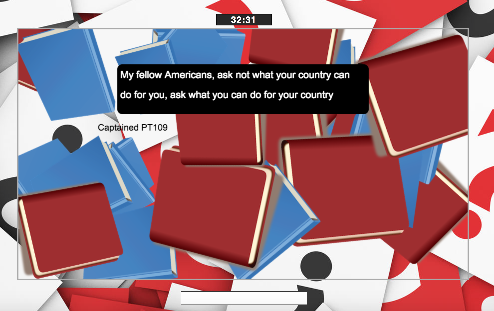

# You Need To Hit The Books!
[You Need To Hit The Books live][game] **Play the game!**

[game]: https://aaronbnb.github.io/

You Need To Hit The Books! is a JavaScript quote-guessing quiz game, sharing some of my favorite thoughts. You Need To Hit The Books! records players' scores and time to get through the game's ten rounds. Players guess the quotes and have to hit the books to reveal hints.

## Features & Implementation

You Need To Hit The Books! relies on 'vanilla' JavaScript for logic and uses the Easel.js library to interact with the HTML5 'canvas' element.

### Drag + Drop Icons

  The game uses Easel.js' to implement drag and drop functionality on the book icons, allowing players to reveal hints if they don't know the quotation.

  You Need To Hit The Books! sets up a multi-layered canvas. For each round of the game, it renders quotes as the base layer. It then sets up a layer, with bitmaps on each book image. In `Board`, each book icon is given a random size, rotation, and location on the canvas. Event listeners are then placed on each icon, measuring offset from the book icons' original coordinates, providing the drag and drop functionality.


    `Board` drag and drop method:
    ```javascript
    for (var i = 1; i < 30; i++) {
      let book = (i % 2 === 0) ? this.image1 : this.image2;
      let bitmap = new createjs.Bitmap(book);
      container.addChild(bitmap);
      bitmap.x = .9 * this.canvas.width * Math.random() | 0;
      bitmap.y = .9 * this.canvas.height * Math.random() | 0;
      bitmap.rotation = 360 * Math.random() | 0;
      bitmap.regX = bitmap.image.width / 2 | 0;
      bitmap.regY = bitmap.image.height / 2 | 0;
      bitmap.scaleX = bitmap.scaleY = bitmap.scale = Math.random() * 0.4 + 0.6;
      bitmap.name = "bmp_" + i;
      bitmap.cursor = "pointer";

      bitmap.addEventListener("mousedown", function (evt) {
        var o = evt.target;
        o.parent.addChild(o);
        o.offset = {x: o.x - evt.stageX, y: o.y - evt.stageY};
      }.bind(this));

      bitmap.addEventListener("pressmove", function (evt) {
        var o = evt.target;
        o.x = evt.stageX + o.offset.x;
        o.y = evt.stageY + o.offset.y;

        this.update = true;
      }.bind(this));

      bitmap.addEventListener("rollover", function (evt) {
        var o = evt.target;
        o.scaleX = o.scaleY = o.scale * 1.2;
        this.update = true;
      }.bind(this));

      bitmap.addEventListener("rollout", function (evt) {
        var o = evt.target;
        o.scaleX = o.scaleY = o.scale;
        this.update = true;
      }.bind(this));
    }
    this.stage.update();
    ```

### Timer

  A simple `Timer` is used to add another level of competition and scoring to the game. The timer initiates at game start and stops at conclusion of final round.

### Answer Input

  Using asynchronous functions, players' answer input is dynamically evaluated, allowing users to try different guesses before submitting an answer. The game then clears the answer field.


## Future Directions for the Project

In addition to the features already implemented, I will continue to work on the game, adding additional features to improve player experience.

### Randomizing Quotations

  I plan to add a separate CSV file with quotes so that the rounds and quotes/hints can be randomized. I will also add difficulty levels to each quotes, allowing players to select the difficulty for the game.

### Persisting scores

  I will add a backend so that users can submit and save high scores and see the leaderboard at the end of the game.

### Links To Github Repo/Profile

  I plan to add an event listener to scorecard at the end, sending users to either the repo for the game or my user project.
